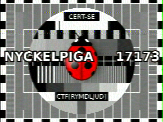

## Broadcast:

Looking in the broadcast.7z file we can see a folder named "Zipper\.secret".  

In "Zipper\.secret"  we can see:  
Folder | Content
----|----
 \- | flag.txt  
 ! | broadcast.wav  
 0 | 3  
 4 | 6  
 5 | 11  
 c | 1  
 D | 7  
 h | 2  
 j | 10   
 k | 4  
 l | 5  
 m | 8  
 o | 9  

Trying to extract the files we can see that flag.txt and broadcast.wav is password protected.  
All other s are extracted!  
Rearaning the  sorting from the number on the file within the .  
Folder | Content
----|----
c | 1  
h | 2  
0 | 3  
k | 4  
l | 5  
4 | 6  
D | 7  
m | 8  
o | 9  
j | 10  
5 | 11  

Password for 7Zip is:  
ch0kl4Dmoj5

Flag.txt:
```
ctf[skulle_skippat_linbanan]
```

Playing broadcast.wav and we are reminded of a dailup modem.  
Remembering the IRC message from Kammen about ISS and Apollo we can conclude that it is an HAM raido signal.  
Using any SSTV application and we can decode the image that inclide the secound flag in this 7Zip file. 
I Used https://play.google.com/store/apps/details?id=xdsopl.robot36&hl=en&gl=US
 
  

broadcast.wav flag:
```
CTF[RYMDLJUD]
```

