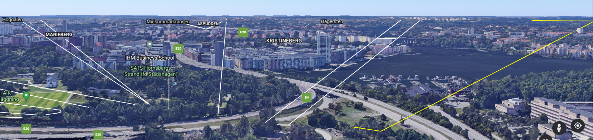

## forensics challange:

There is a IRC DCC SEND file transfer found in pcap.  
File:Star!6.kmz    

To extract the file we can use Wireshark:  
filter on ´tcp.stream eq 270´  
Nothe that there are two streams with the file transfere but one is incomplete!

Right clicka and TCP follow the stream.  
Then save as RAW to fil 'Star!6.kmz'  
  

From the ´star!6.kmz´ we can unpack a doc.kml file (Winrar/7zip/binwalk)  

"KML is a file format used to display geographic data in an Earth browser such as Google Earth. KML uses a tag-based structure with nested elements and attributes and is based on the XML standard."


  
The Center of the lines looks to be originating from "Tomteboda" the building where cert.se has there office.     

What would happen if we simulate standing on there rooftop?  


  
Now that looks more like it!  
```  
XGU[IVHRORVMH]  
```

We do know that XGU should be CTF so it looks like an atbash-chiper.  
https://www.dcode.fr/atbash-cipher

Flag:
```   
CTF[RESILIENS]
```   
